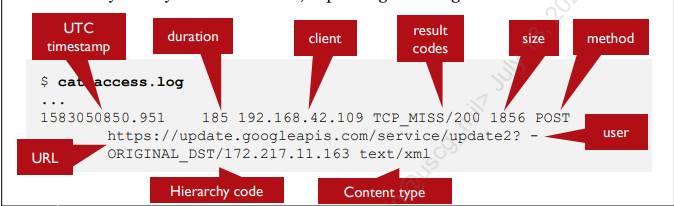

# Lab 1 Live Investigations and Static Analysis

## 1.1 Live Windows Forensics

### Networking

```powershell
# netstat  
netstat -naob 
```

flags:

- -n: display unresolved IP addresses
- -a: active TCP connections and listening ports
- -o: see the process id numbers on each line
- -b: shows the program associated with each listening port

#### tcpdump

```bash
# Capture all traffic on eth0 interface and write to file capture.pcap
tcpdump -i eth0 -w capture.pcap

# all traffic not from 192.168.0.75 and going to dest 10.10.10.10
tcpdump -eth0 'not src 192.168.0.75 and dst 10.10.10.10'

# Only ping traffic going to host 10.10.10.10
tcpdump -eth0 'icmp and (dst host 10.10.10.10)'
```

Additional flags:

- -r: read packets from file
- -n: do not resolve IP addresses
- -A: display payload

#### Squid Log Format



### Processes and Services

```powershell
# wmic
wmic process list brief

HandleCount  Name                                 Priority  ProcessId  ThreadCount  WorkingSetSize
0            System Idle Process                  0         0          16           8192
4263         System                               8         4          307          98304
0            Secure System                        8         104        0            75112448
0            Registry                             8         180        4            29081600
53           smss.exe                             11        588        2            954368
805          csrss.exe                            13        904        12           2928640
...

# Startup tasks run with the OnStartup reg key
wmic startup
Caption          Command      Description      Location    Name     SettingID   User   UserSID                                         
OneDriveSetup    C:\Windows\SysWOW64\OneDriveSetup.exe /thfirstsetup             OneDriveSetup   HKU\S-1-5-19\SOFTWARE\Microsoft\Windows\CurrentVersion\Run  OneDriveSetup       NT AUTHORITY\LOCAL SERVICE    S-1-5-19                                        


# filtering wmic
wmic process where processid=1924 list brief
HandleCount  Name      Priority  ProcessId  ThreadCount  WorkingSetSize
393          Code.exe  8         1924       23           118124544

# sc command (services)
sc.exe query type= service

SERVICE_NAME: Appinfo
DISPLAY_NAME: Application Information
        TYPE               : 30  WIN32  
        STATE              : 4  RUNNING 
                                (STOPPABLE, NOT_PAUSABLE, IGNORES_SHUTDOWN)
        WIN32_EXIT_CODE    : 0  (0x0)
        SERVICE_EXIT_CODE  : 0  (0x0)
        CHECKPOINT         : 0x0
        WAIT_HINT          : 0x0
...

# tasks
tasklist /svc

Image Name                     PID Services                                    
========================= ======== ============================================
System Idle Process              0 N/A                                         
System                           4 N/A                                         
Secure System                  104 N/A                                         
Registry                       180 N/A                                         
smss.exe                       588 N/A                                         
csrss.exe                      904 N/A                                         
wininit.exe                   1000 N/A                                         
csrss.exe                     1012 N/A                                         
services.exe                   940 N/A                                         
winlogon.exe                  1040 N/A                                         
LsaIso.exe                    1072 N/A                                         
lsass.exe                     1084 KeyIso, SamSs, VaultSvc 
...

# Scheduled Tasks
schtasks

Folder: \
TaskName                                 Next Run Time          Status         
======================================== ====================== ===============
Adobe Acrobat Update Task                7/13/2022 12:00:00 PM  Ready          
Git for Windows Updater                  7/13/2022 10:40:30 AM  Ready          
GoogleUpdateTaskMachineCore{9F760870-331 7/13/2022 8:41:31 AM   Ready          
GoogleUpdateTaskMachineUA{15D2B141-0AA4- 7/12/2022 3:41:31 PM   Ready          
MicrosoftEdgeShadowStackRollbackTask     N/A                    Ready          
MicrosoftEdgeUpdateTaskMachineCore       7/13/2022 9:30:35 AM   Ready          
MicrosoftEdgeUpdateTaskMachineUA         7/12/2022 4:00:35 PM   Ready          
npcapwatchdog                            N/A                    Ready          
OneDrive Per-Machine Standalone Update T 7/13/2022 10:17:55 AM  Ready          
OneDrive Reporting Task-S-1-5-21-3537334 7/13/2022 3:05:20 PM   Ready          

Folder: \Agent Activation Runtime
TaskName                                 Next Run Time          Status         
======================================== ====================== ===============
S-1-5-21-3537334053-1003481608-288984282 N/A                    Disabled       

Folder: \Microsoft
TaskName                                 Next Run Time          Status         
======================================== ====================== ===============
INFO: There are no scheduled tasks presently available at your access level.

Folder: \Microsoft\Office
TaskName                                 Next Run Time          Status         
======================================== ====================== ===============
Office Automatic Updates 2.0             7/13/2022 9:00:26 AM   Ready          
Office ClickToRun Service Monitor        7/13/2022 8:16:54 AM   Ready          
Office Feature Updates                   7/12/2022 8:25:45 PM   Ready          
Office Feature Updates Logon             N/A                    Ready          
OfficeTelemetryAgentFallBack2016         N/A                    Ready          
OfficeTelemetryAgentLogOn2016            N/A                    Ready       
...

# Delete scheduled task
schtasks /delete /tn MaliciousTask
```

### Registry

```powershell
reg query HKEY_LOCAL_MACHINE\Software\Microsoft\Windows\CurrentVersion\Run

HKEY_LOCAL_MACHINE\Software\Microsoft\Windows\CurrentVersion\Run
    SecurityHealth    REG_EXPAND_SZ    %windir%\system32\SecurityHealthSystray.exe
    RtkAudUService    REG_SZ    "C:\Windows\System32\DriverStore\FileRepository\realtekservice.inf_amd64_200389f68a8e25cd\RtkAudUService64.exe" -background
    WavesSvc    REG_SZ    "C:\Windows\System32\DriverStore\FileRepository\wavesapo10de.inf_amd64_ed8cfd6e0eecb72a\WavesSvc64.exe" -Jack
```

## 1.2 Falsimentis (Linux) AWK

CEO Computer: __172.16.42.107__

Process:

1. Search for attacker domain in Squid Proxy log (assuming they use standard ports for HTTP(S))
2. Confirm timeline of events of when files were downloaded from that domain (access.log)
3. Look for abnormally high traffic volume (__beacons__) from the victim device
4. Pivot to other hosts infected by searching on the domain with abnormally high traffic (access.log)

Find additional compromised hosts:

```bash
# Gets all the unique IP addresses that reached out to a domain starting with www1
TZ=America/Los_Angeles awk '/www1/ {print strftime("%T", $1), $3}' access.log | sort -u -k2,2 

# Alternative method
awk '/www1/ {print $3}' access.log | sort -u

172.16.42.103
172.16.42.105
172.16.42.107
172.16.42.108
172.16.42.109
```

awk flags:

- -F: use colon as delimiter (requires the : as well)
- '{print $3}': outputs the third column

## 1.3 Memory Investigation

```bash
# Volatility env startup
cd /opt/volatility
source venv/bin/activate

# Don't export file location or profile, per the instrtuctions.
python vol.py -f /home/sec504/labs/falsimentis/FM-TETRIS.mem --profile=Win10x86_15063 netscan

Offset(P)          Proto    Local Address                  Foreign Address      State            Pid      Owner          Created
0x856e2a40         UDPv4    127.0.0.1:512                  *:*                                   976      svchost.exe    2020-03-19 01:34:49 UTC+0000
0x857e9968         TCPv4    172.16.42.103:55383            54.152.208.117:443   ESTABLISHED      3872     firefox.exe    
0x85ae2a40         UDPv4    127.0.0.1:512                  *:*                                   976      svchost.exe    2020-03-19 01:34:49 UTC+0000
0x85be9968         TCPv4    172.16.42.103:55383            54.152.208.117:443   ESTABLISHED      3872     firefox.exe    
0x893a0d78         UDPv4    127.0.0.1:512                  *:*                                   4856     svchost.exe    2020-03-19 01:35:04 UTC+0000
0x8b118ab0         TCPv4    172.16.42.103:50814            23.211.108.33:443    CLOSE_WAIT       3688     SearchUI.exe   
0x8b15ecb8         TCPv4    172.16.42.103:51319            13.107.246.10:443    CLOSE_WAIT       3688     SearchUI.exe   
```

Volatility plugins:

- netscan: lists network connections at time of capture with PID, src and dst IP + ports, and protocol
- pstree: lists processes running when memory was captured in dot tree format
- filescan: examines file objects
- dlllist: examines loaded dlls from memory capture

## 1.4 Malware Investigation

Most of this is using RegShot, ProcMon, and examining network traffic logs in a dynamic investigation.

## 1.5 Cloud Investigation

This lab is mainly log file analysis of AWS CloudTrail, VPC, and S3 bucket logs.
May return to look at tools.
