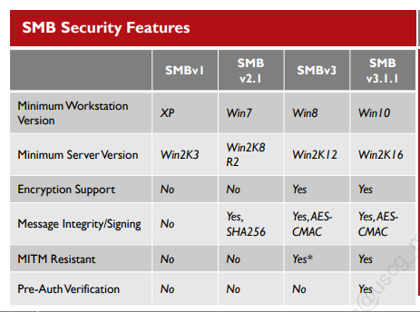
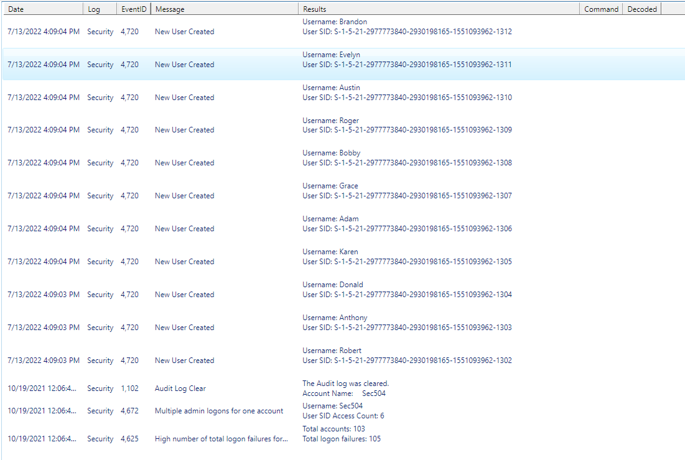

# Lab 2 Recon, Scanning, Enumeration

## 2.1 Spiderfoot and OSINT

Sections:

- Browse: general results sorted by data type/ source
- Graph: Shows a relationship between a datapoint from one plugin that seeds another plugin result
- Status: shows a bar chart of all the plugins used to evaluate the target and the number of results

Relevant Browse sections:

- Affiliate - Internet Name: identifies the service providers and hosting companies associated with the target
- Co-Hosted Site - Domain Name: shows any domain names associated with a discovered target
- Email Addresses: shows any email addresses found during a webcrawl
- Hacked Email Address: (typically found with HaveIBeenPwned)
- Web Technology: see what technology the website was built with (e.g. PHP, Linode, Meteor, GoDaddy SSL, etc.)

## 2.2 DNS Interrogation

__TCP packets to port 53 are indicators of network mapping.__

We use ```whois``` to query the authoritative DNS server for the domain.

```bash
whois falsimentis.com
```

### Dig

We use Dig to query DNS servers from the ISC.

```bash
dig @172.30.0.254 A www.falsimentis.com

; <<>> DiG 9.11.3-1ubuntu1.13-Ubuntu <<>> @172.30.0.254 A www.falsimentis.com
; (1 server found)
;; global options: +cmd
;; Got answer:
;; ->>HEADER<<- opcode: QUERY, status: NOERROR, id: 7889
;; flags: qr aa rd; QUERY: 1, ANSWER: 1, AUTHORITY: 0, ADDITIONAL: 1
;; WARNING: recursion requested but not available

;; OPT PSEUDOSECTION:
; EDNS: version: 0, flags:; udp: 1232
; COOKIE: 3a50ec9f7ac860590100000062cdd3e4d6d61755b302b37b (good)
;; QUESTION SECTION:
;www.falsimentis.com.		IN	A

;; ANSWER SECTION:
www.falsimentis.com.	86400	IN	A	45.76.171.86

;; Query time: 9 msec
;; SERVER: 172.30.0.254#53(172.30.0.254)
;; WHEN: Tue Jul 12 20:04:52 UTC 2022
;; MSG SIZE  rcvd: 92

# Zone Transfer request
dig +short @172.30.0.254 AXFR falsimentis.com
```

## 2.3 NMAP + Mapping

Lots of ARP packets looking for hosts sequentially indicate host discovery.

### Ping

Multiple pings to/ from IPs within the same network `-->` network mapping.

### TTL

In both IPv4 & IPv6 __valid TTL or Hop Limits are 0-254__

If the value is 0, the router sends back a __Time Exceeded__ message.

```bash
# NMAP host discovery (can also give CIDR range)
sudo nmap -sn 192.168.1.1-254

# Uses a SYN scan on all ports, gets version of service if possible
nmap -sV -sS -p- 172.30.0.254

# Script DNS brute interrogation
sudo nmap --script dns-brute 172.30.0.254

Starting Nmap 7.60 ( https://nmap.org ) at 2022-07-12 20:11 UTC
Nmap scan report for ns1.falsimentis.com (172.30.0.254)
Host is up (0.000030s latency).
Not shown: 999 closed ports
PORT   STATE SERVICE
53/tcp open  domain
MAC Address: 02:42:AC:1E:00:FE (Unknown)

Host script results:
| dns-brute: 
|   DNS Brute-force hostnames: 
|     news.falsimentis.com - 172.17.0.183
|     ns1.falsimentis.com - 172.30.0.254
|     ns2.falsimentis.com - 10.200.81.238
|     mail.falsimentis.com - 104.47.73.10
|_    www.falsimentis.com - 45.76.171.86

```

## 2.4 Cloud Scanning

```bash
masscan -p 443 --rate 10000 10.200.0.0/16

open tcp 443 10.200.13.31 1657656895
open tcp 443 10.200.140.181 1657656896
open tcp 443 10.200.89.164 1657656896
open tcp 443 10.200.84.164 1657656897
open tcp 443 10.200.23.203 1657656897
open tcp 443 10.200.30.42 1657656897
open tcp 443 10.200.137.13 1657656898
open tcp 443 10.200.125.68 1657656898
open tcp 443 10.200.74.2 1657656898
open tcp 443 10.200.1.10 1657656899
open tcp 443 10.200.0.3 1657656900
open tcp 443 10.200.227.71 1657656901
open tcp 443 10.200.11.125 1657656901
open tcp 443 10.200.248.218 1657656901
```

## 2.5 SMB + RPC Sessions

If __SMBv2__ is turned on and v1 is turned off, __SHA-256 signing is enabled__ for message integrity.

Domain controllers have a business need for SMB



SMB Shares:

- IPC$: used for remote access
- C$: requires admin privileges, allow disk access

```powershell
# Establish SMB session from Windows
C:\WINDOWS\system32>net use \\targetip

C:\WINDOWS\system32>net use \\targetip\sharename password /u:username
```

```bash
# May need to use -m SMB2 if negotiation fails because SMBv1 is disabled on the target
smbclient -L 10.10.0.1 -U sec504
WARNING: The "syslog" option is deprecated
Enter WORKGROUP\\sec504\'s password: sec5-4

	Sharename       Type      Comment
	---------       ----      -------
	ADMIN$          Disk      Remote Admin
	C$              Disk      Default share
	IPC$            IPC       Remote IPC

rpcclient 10.10.0.1 -U sec504

rpcclient $> enum<TabTab>
enumalsgroups      enumdomusers       enummonitors       enumprocs
enumdata           enumdrivers        enumports          enumtrust
enumdataex         enumforms          enumprinters       
enumdomains        enumjobs           enumprivs          
enumdomgroups      enumkey            enumprocdatatypes

# Gives use all the users on the system and the RID (suffix of the SID)
rpcclient $> enumdomusers
user:[Administrator] rid:[0x1f4]
user:[DefaultAccount] rid:[0x1f7]
user:[Guest] rid:[0x1f5]
user:[Sec504] rid:[0x3e8]
user:[WDAGUtilityAccount] rid:[0x1f8]

# Enumerate server info and groups
rpcclient $> srvinfo
	10.10.0.1      Wk Sv NT PtB LMB     Sec504Student
	platform_id     :	500
	os version      :	10.0
	server type     :	0x51003

rpcclient $> enumalsgroups domain
group:[Ssh Users] rid:[0x3e9]

# Pull internal groups
rpcclient $> enumalsgroups builtin
group:[Access Control Assistance Operators] rid:[0x243]
group:[Administrators] rid:[0x220]
group:[Backup Operators] rid:[0x227]
group:[Cryptographic Operators] rid:[0x239]
group:[Distributed COM Users] rid:[0x232]
group:[Event Log Readers] rid:[0x23d]
group:[Guests] rid:[0x222]
...

# Lookup SIDs
rpcclient $> lookupnames administrator
administrator S-1-5-21-2977773840-2930198165-1551093962-500 (User: 1)

# Enumerate Admins Account Details
rpcclient $> queryuser 500
	User Name   :	Administrator
	Full Name   :	
	Home Drive  :	
	Dir Drive   :	
	Profile Path:	
	Logon Script:	
	Description :	Built-in account for administering the computer/domain
	Workstations:	
	Comment     :	
	Remote Dial :
	Logon Time               :	Thu, 01 Jan 1970 00:00:00 UTC
	Logoff Time              :	Thu, 01 Jan 1970 00:00:00 UTC
	Kickoff Time             :	Thu, 14 Sep 30828 02:48:05 UTC
	Password last set Time   :	Thu, 01 Jan 1970 00:00:00 UTC
	Password can change Time :	Thu, 01 Jan 1970 00:00:00 UTC
	Password must change Time:	Thu, 14 Sep 30828 02:48:05 UTC
	unknown_2[0..31]...
	user_rid :	0x1f4
	group_rid:	0x201
	acb_info :	0x00000211
	fields_present:	0x00ffffff
	logon_divs:	168
	bad_password_count:	0x00000000
	logon_count:	0x00000000
	padding1[0..7]...
	logon_hrs[0..21]...
```

### Terminating sessions

```powershell
# Find the session
C:\WINDOWS\system32>net session

Computer               User name            Client Type       Opens Idle time
-------------------------------------------------------------------------------
\\10.10.75.1           sec504                                     6 00:02:31
The command completed successfully.

# Kill inbound session
C:\WINDOWS\system32>net session \\10.10.75.1 /del
The session from 10.10.75.1 has open files.

Do you want to continue this operation? (Y/N) [N]: Y
The command completed successfully.
```

## 2.6 Detecting Windows Password Spraying

This section uses the DeepBlueCLI PowerShell module to comb Windows event logs for anomalous events like event log manipulation, user account creation, logon failures, Metasploit activity, etc.

